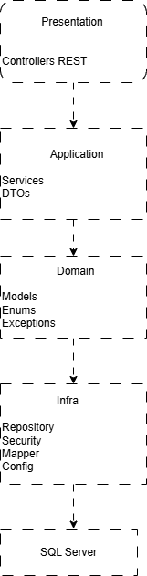
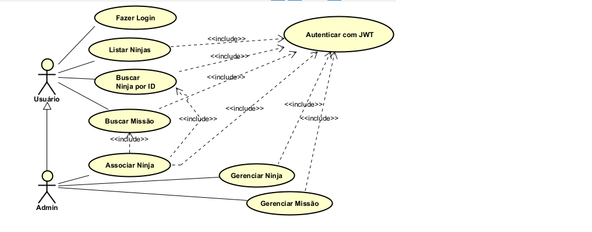

# Cadastro de Ninjas API

API REST desenvolvida com Spring Boot para gerenciamento de Ninjas e Missões, com autenticação JWT, controle de acesso baseado em perfis (ADMIN e USER), documentação Swagger e cobertura de testes unitários e de integração.

---

## Arquitetura da Solução



### Camadas

- **Presentation**: Controllers REST e endpoints da API
- **Application**: Services e regras de negócio
- **Domain**: Entidades, exceções e regras do domínio
- **Infra**: Repositórios, segurança, mappers e configurações

---

## Casos de Uso



---

## Tecnologias Utilizadas

- Java 17
- Spring Boot
- Spring Security
- JWT
- Spring Data JPA
- SQL Server
- Swagger/OpenAPI
- JUnit 5
- Mockito
- MockMvc
- Maven

---

## Funcionalidades

### Usuários

- Cadastro de usuários
- Autenticação via JWT
- Controle de acesso por perfil

### Ninjas

- Criar ninja
- Buscar ninja por ID
- Listar ninjas
- Atualizar ninja
- Remover ninja
- Buscar ninja por nome
- Buscar ninja por trecho do nome

### Missões

- Criar missão
- Atualizar missão
- Remover missão
- Listar missões

### Relacionamentos

- Associação de ninjas a missões

---

## Segurança

A aplicação utiliza autenticação baseada em JWT.

### Perfis disponíveis

- ROLE_ADMIN
- ROLE_USER

### Permissões

| Operação | ADMIN | USER |
|-----------|---------|---------|
| GET Ninjas | ✅ | ✅ |
| POST Ninjas | ✅ | ❌ |
| PUT Ninjas | ✅ | ❌ |
| DELETE Ninjas | ✅ | ❌ |
| GET Missões | ✅ | ✅ |
| POST Missões | ✅ | ❌ |
| PUT Missões | ✅ | ❌ |
| DELETE Missões | ✅ | ❌ |

---

## Testes

### Testes Unitários

Cobertura das regras de negócio da camada Service utilizando:

- JUnit 5
- Mockito

### Testes de Integração

Validação dos endpoints REST utilizando:

- Spring Boot Test
- MockMvc
- JWT real da aplicação

---

## Documentação da API

A documentação está disponível através do Swagger:

```text
http://localhost:8080/swagger-ui/index.html
```

---

## Como Executar

### Clonar o projeto

```bash
git clone https://github.com/DelclecianoSuporte/CadastroDeNinjas.git
```

### Entrar na pasta do projeto

```bash
cd CadastroDeNinjas
```

### Executar a aplicação

```bash
mvn spring-boot:run
```

---
